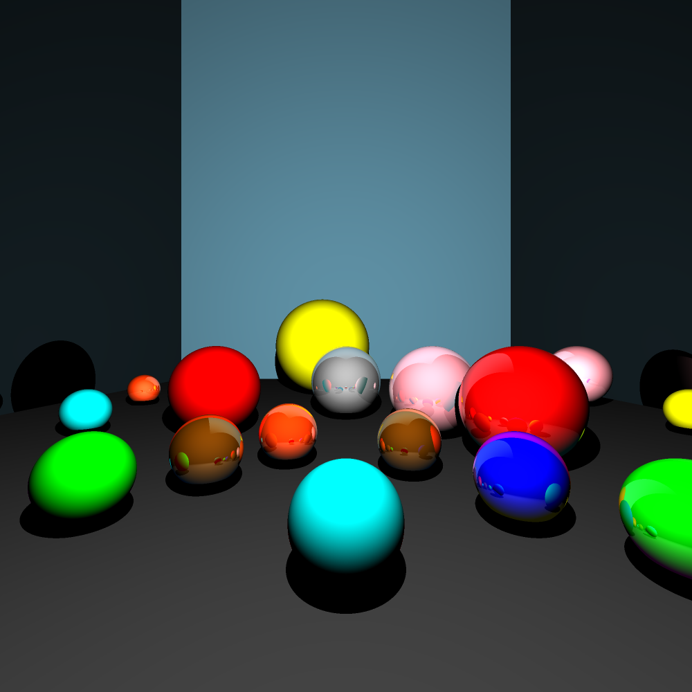
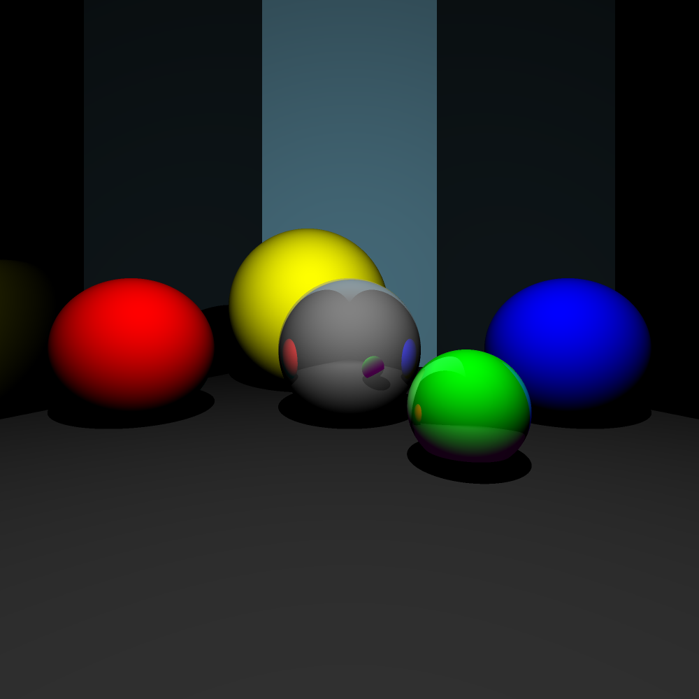
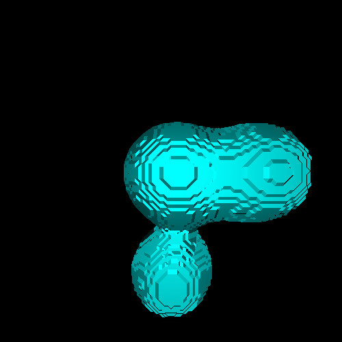
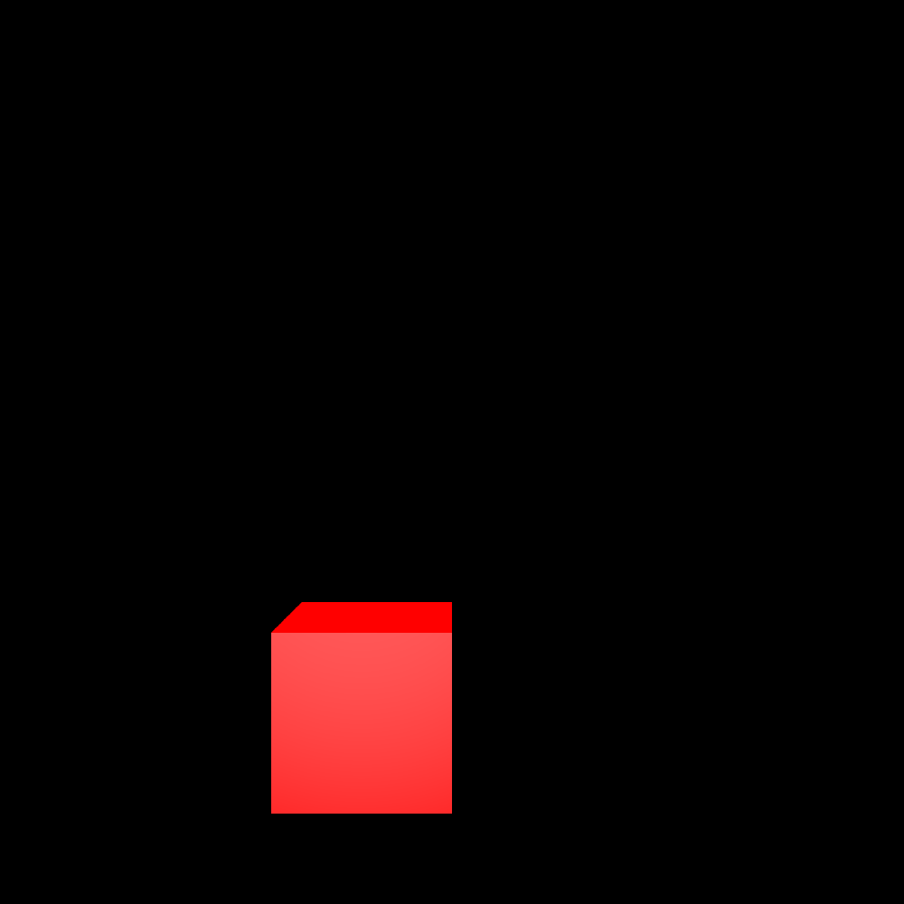
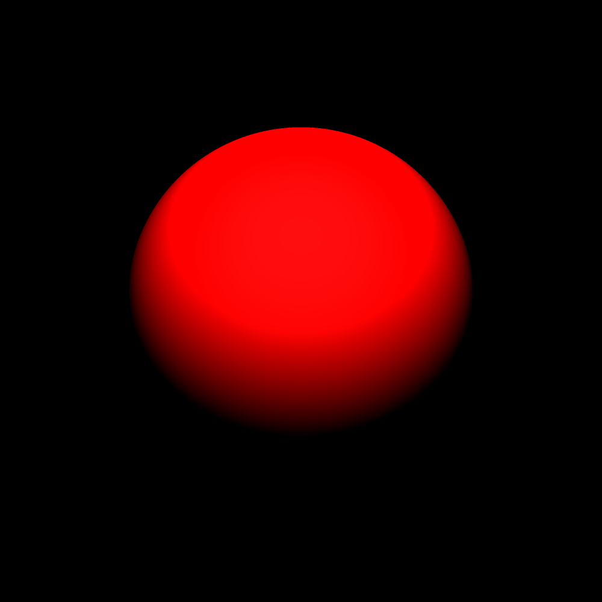

# CPU Ray tracer

## Build

``make``

## Run
Usage:
 ``./raytracer file.scene outputfile.ppm width height aliasing_level reflection_max_depth``

* **file.scene**: the input file (must have the .scene format)
* **output.ppm**: the output file (ppm format)
*  **width**: width of the resolution of the output frame
*  **height**: height of the resolution of the output frame
*  **aliasing level**: level of aliasing by side. (i.e if aliasing level equals to 2, compute the mean of 2x2=4 pixels)
* **reflection_max_depth**: The maximum depth for the reflection

## Geometric figures

* Plan
* Sphere
* Raybox
* Triangle
* Metaball

## Scenes

The raytracer reads a specific file format ``.scene``.

A scene consists of a camera, a collection of lights and a collection of translatable and intersectable objects (geometric figures)

### Sample

A scene file ``scenes/sample.scene`` describes how to write a scene file for each geometric figures, camera and lights. 

### Examples

Several more samples can be found in ``scenes/*``

## Output

